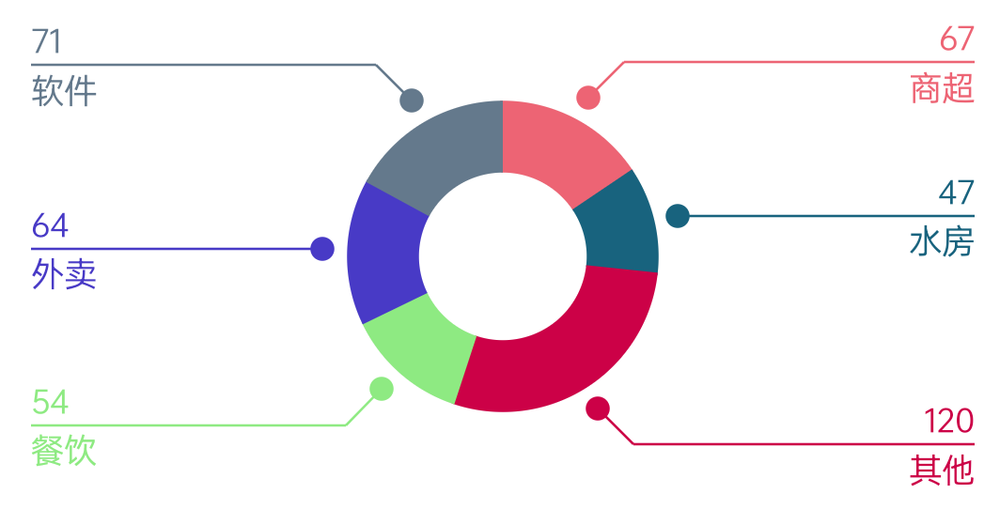

# CircleStatisticsView
圆圈统计图  
1.类支付宝统计   
2.动画显示    
# 预览

# 资源
|名字|资源|
|-|-|
|AAR|[calendar_view.aar](https://github.com/RelinRan/CircleStatisticsView/blob/main/circle_statistics_view.aar)|
|Gitee|[CircleStatisticsView](https://gitee.com/relin/CircleStatisticsView)|
|GitHub | [CircleStatisticsView](https://github.com/RelinRan/CircleStatisticsView)|
# Maven
1.build.grade | setting.grade
```
repositories {
	...
	maven { url 'https://jitpack.io' }
}
```
2./app/build.grade
```
dependencies {
	implementation 'com.github.RelinRan:CircleStatisticsView:2022.6.10.1'
}
```
# xml
```
<com.androidx.widget.CircleStatisticsView
    android:id="@+id/csv"
    android:layout_width="match_parent"
    android:background="@android:color/white"
    android:layout_height="320dp"/>
```
# attr.xml
```
<!--圆圈背景颜色-->
<attr name="circleBackgroundColor" format="color|reference" />
<!--圆点边距-->
<attr name="dotMargin" format="dimension|reference" />
<!--圆点半径-->
<attr name="dotRadius" format="dimension|reference" />
<!--标记线处X差值-->
<attr name="lineGapX" format="dimension|reference" />
<!--标记线处Y差值-->
<attr name="lineGapY" format="dimension|reference" />
<!--标记线文字和线的间距-->
<attr name="lineNearTextMargin" format="dimension|reference" />
<!--标记线粗细-->
<attr name="lineStrokeWidth" format="dimension|reference" />
<!--标记文字大小-->
<attr name="markTextSize" format="dimension|reference" />
<!--标记文字颜色-->
<attr name="markTextColor" format="color|reference" />
<!--是否使用动画-->
<attr name="isAnimation" format="boolean" />
<!--动画持续时间-->
<attr name="animationDuration" format="integer|reference" />
```
# 使用
```
CircleStatisticsView csv = findViewById(R.id.csv);
//测试数据
List<String> data = new ArrayList<>();
data.add("67");
data.add("47");
data.add("120");
data.add("54");
data.add("64");
data.add("71");
//构建显示数据
float percent[] = Statistical.toPercent(data);
int color[] = Colors.randomColors(data.size());
String[] markTop = Statistical.toMarks(data);
String[] markBottom = {"商超", "水房", "其他", "餐饮", "外卖", "软件"};
List<Statistical> list = new ArrayList<>();
for (int i = 0; i < percent.length; i++) {
    list.add(new Statistical(percent[i], color[i], color[i], markTop[i], markBottom[i]));
}
//设置数据
csv.setDataSource(list);
```
